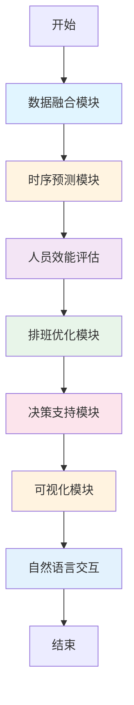

# 配网调度业务量智能预测系统 - 智能体架构设计文档

## 1. 总体架构

### 1.1 架构层次图

```
┌─────────────────────────────────────────────────────────────────┐
│                        用户交互层                                │
│  ┌──────────────┐  ┌──────────────┐  ┌──────────────┐         │
│  │  Web前端界面 │  │  自然语言交互 │  │  报告生成    │         │
│  └──────────────┘  └──────────────┘  └──────────────┘         │
└─────────────────────────────────────────────────────────────────┘
                              ↓
┌─────────────────────────────────────────────────────────────────┐
│                        业务逻辑层 (Agent Core)                   │
│  ┌──────────────────────────────────────────────────────────┐  │
│  │                  LangGraph 编排引擎                        │  │
│  │  ┌──────────┐  ┌──────────┐  ┌──────────┐  ┌─────────┐ │  │
│  │  │ 数据融合 │→│ 时序预测 │→│ 排班优化 │→│ 决策支持│ │  │
│  │  └──────────┘  └──────────┘  └──────────┘  └─────────┘ │  │
│  └──────────────────────────────────────────────────────────┘  │
└─────────────────────────────────────────────────────────────────┘
                              ↓
┌─────────────────────────────────────────────────────────────────┐
│                        核心算法层                                 │
│  ┌──────────────────┐  ┌──────────────────┐                    │
│  │  时序预测算法    │  │  排班优化算法    │                    │
│  │  - Prophet       │  │  - 遗传算法      │                    │
│  │  - LSTM/Transformer│  │  - 约束求解    │                    │
│  │  - XGBoost       │  │  - 公平性优化    │                    │
│  └──────────────────┘  └──────────────────┘                    │
│  ┌──────────────────────────────────────────────┐              │
│  │  人员效能评估算法                              │              │
│  │  - 工作量评估                                 │              │
│  │  - 效能建模                                   │              │
│  │  - 增员建议                                   │              │
│  └──────────────────────────────────────────────┘              │
└─────────────────────────────────────────────────────────────────┘
                              ↓
┌─────────────────────────────────────────────────────────────────┐
│                        数据访问层                                │
│  ┌──────────────┐  ┌──────────────┐  ┌──────────────┐         │
│  │  数据库接口  │  │  外部API接口 │  │  文件存储    │         │
│  │  - MySQL     │  │  - 天气API   │  │  - S3存储    │         │
│  │  - PostgreSQL│  │  - OMS接口   │  │  - 本地文件  │         │
│  └──────────────┘  └──────────────┘  └──────────────┘         │
└─────────────────────────────────────────────────────────────────┘
```

### 1.2 核心模块说明

#### 1.2.1 数据融合模块 (Data Fusion)
- **功能**：整合多源数据，进行数据清洗、标准化和特征工程
- **数据源**：
  - 历史调度数据（调度记录、故障记录）
  - 天气数据（和风天气API）
  - 节假日信息
  - 设备状态数据
  - 人员信息（技能、经验、出勤）
- **输出**：融合后的标准化数据集

#### 1.2.2 时序预测模块 (Time Series Prediction)
- **功能**：基于历史数据和外部因素，预测未来业务量
- **算法**：
  - **Prophet**：处理趋势、季节性、节假日效应
  - **LSTM/Transformer**：捕捉长期依赖和复杂模式
  - **XGBoost**：集成学习，提升预测精度
- **输入**：历史调度数据 + 天气 + 节假日 + 设备状态
- **输出**：未来7-30天业务量预测结果（调度次数、故障数）

#### 1.2.3 排班优化模块 (Schedule Optimization)
- **功能**：基于预测结果和人员约束，生成最优排班方案
- **算法**：
  - **遗传算法**：全局优化，处理复杂约束
  - **约束求解**：确保排班符合业务规则
  - **公平性优化**：保证班组轮换公平
- **约束条件**：
  - 一个班组一天只能排一次班
  - 值班长必须1人，正值至少1人，副值至少1人
  - 最大连续工作天数 ≤ 6天
  - 每周晚班次数 ≤ 3次
- **输出**：未来排班方案（人员、角色、班组、班次）

#### 1.2.4 人员效能评估模块 (Staff Efficiency Assessment)
- **功能**：评估人员工作效能，计算工作当量
- **算法**：
  - 工作量评估：基于任务类型和权重计算
  - 效能建模：考虑人员经验、技能等级
  - 增员建议：基于工作当量和人员容量
- **输出**：人员工作量统计、增员建议

#### 1.2.5 决策支持模块 (Decision Support)
- **功能**：综合多模块结果，生成决策建议
- **输入**：预测结果、排班方案、人员效能、风险评估
- **输出**：综合决策报告、风险预警、操作建议

#### 1.2.6 可视化模块 (Visualization)
- **功能**：将数据和结果可视化展示
- **图表类型**：
  - 业务量趋势图（折线图）
  - 人员需求对比图（柱状图）
  - 增员建议图（热力图）
  - 排班甘特图
  - 风险预警仪表盘
- **技术**：Chart.js, ECharts

#### 1.2.7 自然语言交互模块 (Natural Language Interaction)
- **功能**：通过对话方式与系统交互
- **能力**：
  - 自然语言查询（查询历史数据、预测结果）
  - 智能报告生成（自动生成决策报告）
  - 问题诊断与建议
- **技术**：大语言模型（豆包/DeepSeek）

## 2. 模块交互流程

### 2.1 核心业务流程



### 2.2 详细流程说明

#### 流程1：业务量预测流程
```
1. 数据融合模块
   ├── 获取历史调度数据（最近30天）
   ├── 获取天气预报（未来7天）
   ├── 获取节假日信息
   ├── 获取设备状态
   └── 数据清洗和特征工程

2. 时序预测模块
   ├── 使用Prophet进行基础预测
   ├── 使用LSTM捕捉复杂模式
   ├── 使用XGBoost集成提升精度
   ├── 融合多模型预测结果
   └── 输出预测结果 + 置信区间

3. 决策支持模块
   ├── 分析预测趋势
   ├── 识别风险时段
   └── 生成预测报告
```

#### 流程2：智能排班流程
```
1. 数据融合模块
   ├── 获取人员信息（技能、经验、状态）
   ├── 获取生效班组列表
   └── 获取历史排班记录

2. 时序预测模块
   └── 预测未来7-30天业务量

3. 人员效能评估模块
   ├── 计算工作当量
   ├── 评估人员容量
   └── 生成增员建议

4. 排班优化模块
   ├── 使用遗传算法生成排班方案
   ├── 应用约束条件验证
   ├── 优化公平性
   └── 输出最终排班方案

5. 决策支持模块
   ├── 分析排班合理性
   ├── 评估风险
   └── 生成排班报告
```

#### 流程3：自然语言交互流程
```
用户输入
   ↓
意图识别（大语言模型）
   ↓
┌──────────────┬──────────────┬──────────────┐
│  数据查询    │  预测请求    │  报告生成    │
└──────────────┴──────────────┴──────────────┘
   ↓               ↓               ↓
调用相应工具    调用预测模块    调用决策模块
   ↓               ↓               ↓
格式化结果    生成预测结果    生成决策报告
   ↓               ↓               ↓
自然语言输出    自然语言输出    自然语言输出
```

## 3. 数据流设计

### 3.1 数据流向

```
外部数据源
   ├── 历史调度数据（数据库）
   ├── 天气数据（和风天气API）
   ├── 节假日数据（本地文件）
   ├── 设备状态数据（API）
   ├── 人员信息（数据库）
   └── 排班记录（数据库）
         ↓
    数据融合模块
         ↓
    标准化数据集
         ↓
    ┌────┴────┬────────┬────────┐
    ↓         ↓        ↓        ↓
时序预测  人员评估  排班优化  决策支持
    ↓         ↓        ↓        ↓
预测结果  工作当量  排班方案  决策报告
    └────┬────┴────────┴────────┘
         ↓
    可视化模块 + 自然语言交互
         ↓
    用户界面展示
```

### 3.2 数据格式规范

#### 输入数据格式
```json
{
  "historical_data": [
    {
      "date": "2025-01-01",
      "dispatch_count": 50,
      "fault_count": 5,
      "avg_duration_minutes": 30,
      "equipment_count": 10
    }
  ],
  "weather_forecast": [
    {
      "date": "2025-01-08",
      "temperature_max": 35,
      "weather": "晴",
      "humidity": 60,
      "wind_level": 3
    }
  ],
  "holidays": [
    {
      "date": "2025-01-01",
      "name": "元旦"
    }
  ]
}
```

#### 输出数据格式
```json
{
  "prediction_result": {
    "daily_predictions": [
      {
        "date": "2025-01-08",
        "predicted_dispatches": 55,
        "predicted_faults": 6,
        "confidence": 0.85,
        "risk_level": "中"
      }
    ],
    "schedule_result": {
      "schedules": [
        {
          "date": "2025-01-08",
          "shift_type": "早班",
          "team": "A班",
          "staff": [
            {
              "name": "张三",
              "role": "值班长",
              "skill_level": "高级"
            }
          ]
        }
      ]
    },
    "staffing_advice": {
      "total_workload": 120.5,
      "current_staff": 8,
      "recommended_staff": 10,
      "need_add": 2
    }
  }
}
```

## 4. 技术栈

### 4.1 后端技术栈
- **框架**：FastAPI, LangChain, LangGraph
- **语言**：Python 3.12
- **数据库**：MySQL/PostgreSQL
- **时序预测**：
  - Prophet (Facebook)
  - PyTorch (LSTM/Transformer)
  - XGBoost
- **优化算法**：
  - DEAP (遗传算法)
  - SciPy (约束求解)
- **数据处理**：Pandas, NumPy

### 4.2 前端技术栈
- **基础**：HTML5, CSS3, JavaScript (ES6+)
- **框架**：Tailwind CSS
- **可视化**：Chart.js, ECharts
- **图表类型**：
  - 折线图（业务量趋势）
  - 柱状图（人员需求对比）
  - 饼图/环形图（任务分布）
  - 热力图（增员建议）
  - 甘特图（排班）

### 4.3 AI技术栈
- **大语言模型**：豆包 (doubao-seed-1-8-251228)
- **时序预测**：Prophet, LSTM, Transformer
- **集成学习**：XGBoost

## 5. 性能指标

### 5.1 预测准确率
- 业务量预测准确率：≥ 85%
- 故障预测准确率：≥ 80%
- 置信区间覆盖率：≥ 90%

### 5.2 系统性能
- 响应时间：≤ 5秒（单次预测）
- 排班生成时间：≤ 10秒（7天排班）
- 并发支持：≥ 100个用户同时访问

### 5.3 可用性
- 系统可用性：≥ 99.5%
- 数据更新频率：实时（调度数据），每日（天气预报）

## 6. 安全性

### 6.1 数据安全
- 数据传输加密（HTTPS）
- 敏感数据加密存储
- 访问权限控制

### 6.2 API安全
- API密钥认证
- 请求频率限制
- 异常检测与防护

## 7. 扩展性

### 7.1 模块扩展
- 插件化架构，支持新增预测算法
- 可配置的数据源接口
- 可扩展的约束条件

### 7.2 算法扩展
- 支持新增时序预测模型
- 支持自定义优化算法
- 支持多模型融合

## 8. 部署架构

```
┌─────────────────────────────────────────────┐
│              Nginx (反向代理)               │
└─────────────────────────────────────────────┘
                      ↓
┌─────────────────────────────────────────────┐
│          FastAPI 应用服务 (多实例)          │
│  ┌─────────┐  ┌─────────┐  ┌─────────┐    │
│  │ 实例1   │  │ 实例2   │  │ 实例3   │    │
│  └─────────┘  └─────────┘  └─────────┘    │
└─────────────────────────────────────────────┘
                      ↓
┌─────────────────────────────────────────────┐
│              数据库集群                      │
│  ┌─────────┐  ┌─────────┐                  │
│  │ 主库    │  │ 从库    │                  │
│  └─────────┘  └─────────┘                  │
└─────────────────────────────────────────────┘
                      ↓
┌─────────────────────────────────────────────┐
│              对象存储 (S3)                   │
│  ┌─────────┐  ┌─────────┐                  │
│  │ 文件    │  │ 报告    │                  │
│  └─────────┘  └─────────┘                  │
└─────────────────────────────────────────────┘
```

## 9. 运维监控

### 9.1 监控指标
- 系统资源使用率（CPU、内存、磁盘）
- 接口响应时间
- 预测准确率监控
- 数据质量监控

### 9.2 日志管理
- 统一日志格式
- 日志分级（INFO、WARN、ERROR）
- 日志保留策略（30天）
- 异常告警

## 10. 版本规划

### v1.0（当前版本）
- ✅ 基础架构搭建
- ✅ 数据融合模块
- ✅ 基于LLM的预测
- ✅ 排班优化基础功能
- ✅ 工作量统计
- ✅ 基础可视化

### v2.0（目标版本）
- 🔄 Prophet时序预测算法
- 🔄 LSTM/Transformer深度学习预测
- 🔄 人员效能评估算法优化
- 🔄 增员建议算法
- 🔄 自然语言交互增强
- 🔄 高级可视化图表
- 🔄 OMS数据接口集成

### v3.0（未来版本）
- 实时预测更新
- 自适应模型调优
- 多场景排班优化
- 智能决策辅助
- 移动端支持
